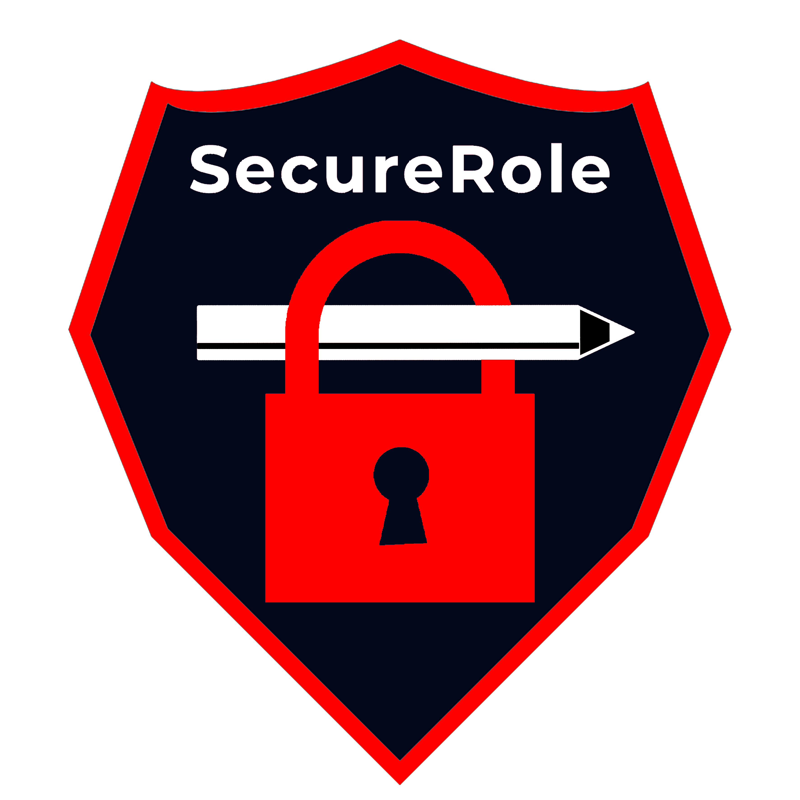

# SecureRole

Hello there!

We are the Team behind SecureRole, the comprehensive library of class materials, regarding role playing scenarios for cyber security courses.

If you already know who we are and what we do (or you don't really want to know), then feel free to skip to the most important topics right away:

- [Collaborators](#collaborators)
- [Legal](#legal)
- [SecureRole Flavors](#securerole-flavors)
- [Content](#content-table)
- [FAQ](#faq)

We strive to provide you with a varied selection of different scenarios, which you can use to teach about the risks of cyber security threats, and how to mitigate them.
For the purpose of this pursuit, we have created a variety of different courses, which you can access free of charge, and use as you please.

## Who are we?

We are Anina Bytyçi, Isaac Würth and Marco Zanetti.
Three bachelor students at OST - Ostschweizer Fachhochschule, currently writing our bachelor thesis. We are all studing information technology, with a special focus on cyber security.

## Why are we doing this?

While the initial idea behind this thesis, was to provide course materials for our own college.
We thought it would be a waste, not to share our gathered knowledge with the world, and make it publicly accessible.
So here we are!

Our main goal is to provide role-playing games that will educate participating students about different types of current cyber attacks.
We will try to choose and create scenarios that have already happened or are similar to known attacks.
This can range from smaller personal incidents, such as a phishing attack, or a social engineering attempt, up to large scale attacks, such as the notpetya malware incident.

We want to teach them how to..:

- ...identify such attacks.
- ...how to behave when being attacked.
- ...how to mitigate the effects of an ongoing attack.
- ...how to prevent attacks.
- ...how to reduce your personal attack surface.
- ...and many more things.

These role playing games come in the form of written "character sheets", like the ones you may be familiar with from classic table top role-playing games (hence nor name Secure Rule)
They provide each player with an insight into their role and supply all the necessary information about their character's behaviour and knowledge.
Now it is up to the students, and one or two teachers/professors/trainers to enact the role playing games, and try to educate their students in a playful and immersive way.

To increase the educational effect, we enrich our role playing games with additional information material.
This can include, but is not limited to:

- Text scripts with explanations
- Course slides
- CVE's
- Third party content, such as videos and news articles
- And many more!

Most of our work will be based on existing work, such as official guidelines, playbooks, and best practices.
We will share a comprehensive list with you, should we use such works, so you can make sure, that the provided materials are up to date and in line with current standards.

# Important information before use

## Collaborators

A special thanks goes to our collaborators, which chose to work with us.
They helped us to improve our work and help us gather critical knowledge to write these course materials.

Do you also want to become a collaborator?
Amazing!

[Be sure to check out our dedicated page for interested collaborators.](COLLABORATION.md)

## Legal

 This work is licensed under a <a rel="license" href="http://creativecommons.org/licenses/by-nc-sa/4.0/">Creative Commons Attribution-NonCommercial-ShareAlike 4.0 International License</a>.

This material may be used freely by public schools for educational purposes.
This is the only agreeable exemption from the non commercial restrictions.

# Content

## SecureRole Flavors

Everything about the way we develop, share, combine, and deliver stories to participants will change from the ground up.
But we are getting ahead of ourselves.
Up until now, when you wanted to play a game from SecureRole (which you probably never did, at this point we haven’t even entered beta testing) you would have picked one of the fully fledged scenarios that we offer you on our github page.
This is currently just the “MalwarePhish” story, with more to come.
That was it.
You would take this story and play it.
That’s good in itself, but it offers little flexibility for you, the user, our most valued stakeholder.
What if you wanted to play a phishing game without the malware part?
Well that would be complicated.
Or if you wanted to play the game, but preferred to learn about NotPetya instead of WannaCry?
That would be impossible, WannaCry is “hardcoded” in our game.
And we had the wish to change that!
So we created SecureRole Flavors.

So what we want to achieve with flavors, is that you can take different aspects from our games and play mix and match.
To give this a clear framework, we used the Lockheed Martin cybersecurity attack killchain.
So from now on you don't have to follow a predefined path, you can choose yourselves what you'd like to have for delivery, persistence or even recon.
Another thing that is important, is that one topic (such as WannaCry in our example), can fall into multiple categories.
But we felt that the killchain gives us the most complete set of categories which we can use to distinguish our flavors.

Currently we only have one topic in store for you, our Ransomware game.

## Content Table

| Kill chain                                                              | Topic                                                            | Extra                                                                                                                                                                      |
| ----------------------------------------------------------------------- | ---------------------------------------------------------------- | -------------------------------------------------------------------------------------------------------------------------------------------------------------------------- |
|                  |              |        |
|          |      |        |
|  |  |        |
|                                                                         |                                                                  |                                                                                                                                                                            |
|                                                                         |                                                                  |                                                                                                                                                                            |

## Prefabricated games

| Name                                                                                                      | Target audience   | Topic                    | Number of players | Time estimate | Version |
| --------------------------------------------------------------------------------------------------------- | ----------------- | ------------------------ | ----------------- | ------------- | ------- |
| [RansomPhish](https://github.com/SecureRole/SecureRole/tree/main/Content/Ransomware) | college and above | OSINT, Phishing, Ransomware | 3-6               | 60min-90min   | v1.0    |

# FAQ

## Can I just use all of this stuff? For free?

Yes you absolutely can.
All of our course material is published under the CC (Creative Commons) License.
That means you can simply use it for your own courses, redistribute it to your friends and teaching colleagues.

One important aspect though!
You may not use our course material for your own financial gain.
We want this material to remain free, in our pursuit for a better education in cyber security.
So we would highly appreciate it if you would support our good cause, by respecting the license agreement.

## I found a mistake in your files!

While we are sorry to hear that a mistake has made its way into our course material, we would highly appreciate if you could let us know how to fix it.

Feel free to contact us, or write us a feature request, detailing the mistake.

You can reach us via:

E-Mail: [secure_role@outlook.com](mailto:secure_role@outlook.com)

Github: [Link](https://github.com/SecureRole/SecureRole)
